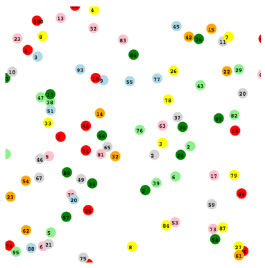
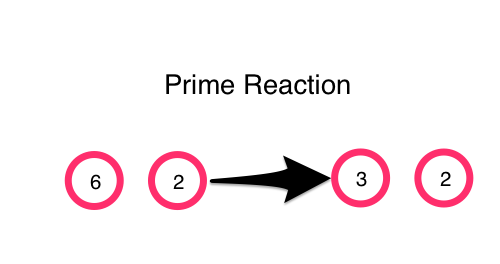

# Chemical Programming




Experiments and explorations in Abstract Chemical Programming based on
the works of:

- [Chemical Computing - by Peter Dittrich](http://link.springer.com/chapter/10.1007/11527800_2)
- [Higher-Order Chemical Programming Style by J. -P. Banâtre, P. Fradet, Y. Radenac](http://link.springer.com/chapter/10.1007/11527800_7)
- [Principles of Chemical Programming by Jean-Pierre Banˆatre, Pascal Fradet and Yann Radenac](http://pop-art.inrialpes.fr/~fradet/PDFs/RULE04.pdf)
- [Programming Self-Organizing Systems with the Higher-Order Chemical Language by JEAN-PIERRE BANATRE, PASCAL FRADET, YANN RADENAC](http://pop-art.inrialpes.fr/~fradet/PDFs/IJUC06a.pdf)


## What is Chemical Programming?

Nature and all living things use chemical reactions to process information on a molecular level.  A few examples are the endocrine system that uses hormones to broadcast information throughout the body, the adaptive defensive processing of the immune system, and signal processing in bacteria. What can we learn from nature about computation?

The Chemical Programming we are exploring is _abstract_.  We are not actually going to create programs with real chemicals, (although that we be really cool as well).  Rather, we are going to use the _metaphor_ of molecules and reactions to performing computations in general.  As we explore this new we of approaching programs, we can step back and see what are the advantages and trade-offs in our using this chemical metaphor in contrast to our traditional programming approach.

## It all starts with a reaction

The heart of the Chemical Programming paradigm is the _reaction_.  It is what happens when two or more _molecules_ react with each other.  Perhaps the simplest way to look at this is using an example.  In this case, let us look at calculating prime numbers.

If we want to compute primes in a naive, traditional way in Clojure, we could make a _is-prime?_ function:

```clojure
(defn is-prime? [n]
  (let [possible-factors (range 2 n)
        remainders (map #(mod n %) possible-factors)]
    (not (some zero? remainders))))

(is-prime? 5)
;; -> true

(is-prime? 6)
;; -> false
```

Given a number, it make a list of all the possible factors from 2 up to that number.  It then loops through and checks to see if there any remainders by diving the number and those factors.  If there are any remainders that are zero, then it is not prime. Using this function, we can them find all the primes to 100.

```clojure
(defn gen-primes [n]
  (filter is-prime? (range 2 (inc n))))

;=> (2 3 5 7 11 13 17 19 23 29 31 37 41 43 47 53 59 61 67 71 73 79 83 89 97)
```

Now, let's look at how we would approach the same problem using Chemical Programming.  The first big difference is that we are going to consider all the integers as molecules.  When two of these integer-molecules meet, they react according to a _prime-reaction_.  The two molecules react accordingly.



We can express this _prime-reaction_ in code with

```clojure
(defn prime-reaction [[a b]]
  (if (and (> a b)
           (zero? (mod a b)))
    [(/ a b) b]
    [a b]))

(prime-reaction [6 2])
;; -> [3 2]

(prime-reaction [5 2])
;; -> [5 2]
```

We can then define our molecules as a range of integers from 2 to 100
and have a _mix-and-react-function_ that will take them and randomly have them interact pairwise by shuffling and partitioning the list.


```clojure
(def molecules (range 2 101))

(defn mix-and-react [mols]
  (let [mixed (partition 2 (shuffle mols))
        reacted (map prime-reaction mixed)]
    (flatten reacted)))

(take 10 (mix-and-react molecules))
;; -> (37 48 87 46 38 91 68 13 39 33)

```

We can see that some changes are being made after one mix and react cycle, but we will need more.

```clojure
(take 10 (reaction-cycle 100))
;; -> (2 2 11 23 2 2 5 3 79 17)
```

After 100 reactions, we can see that the primes are starting to emerge.  This brings us to an important point in Chemical Programming, that the result is obtained after the solution becomes _steady-state_, meaning there are no more changes after reactions.

Once it has obtained this steady state, we can take a measurement of the solution.  In this case we are going to apply a _distinct_ and a _sort_ to all the molecules to get our answer after 1000 reaction cycles.

```clojure
(let [reactions (reaction-cycle 10000)]
  (-> reactions distinct sort))
;; -> (2 3 5 7 11 13 17 19 23 29 31 37 41 43 47 53 59 61 67 71 73 79 83 89 97)
```


## Gamma Chemical Programming

The prime program that we were just exploring is an example of a _Gamma Program_.  It was the first model of computation for a chemical model proposedaround 1986.  The hallmarks of a gamma program are:

- Reaction rules that work on multisets of _molecule elements_
- Reaction rules are made up of a condition and a action
- Execution takes place when the reaction replaces the elements with new elements from reaction result
- The result of the Gamma program is obtained when the solution reaches a steady-state.

Another example of a Gamma program is simple calculation for a _max_.


So far we have been showing examples in Clojure code with no visualization.  But with the help of ClojureScript and core.async.  We can actually make a simulation of a gamma program.  In this simulation, the integers-molecules are shown as being circles floating around in a solution.  They react with each other when they collide.  Each molecule is running its own movement and reaction in its own core.async go-loop.  State is coordinated through a global atom map that keeps track of the position and value of each molecule.  The result is continuously updated on the bottom by sampling the solution with a distinct/sort.


[ClojureScript Gamma Demo](./gamma/resources/public/index.html)


One of the things to note is that we no longer care about any order of operations.  In our original, traditional approach, we cycled through a list in a sequential order.  In the Chemical Programming approach, we have abstracted the reaction to a higher level that no longer cares about order of operations.  This allows us to harness the full powers of concurrency to our problems.


## Higher Order Chemical Programming

So far we have been encoding the _prime-reaction_ and _max_reaction_ directly in our program.  But, we it we took these reaction rules and made them a molecule?  This is the central idea of Higher Order Chemical Programming.

There is a molecule that has as its value a _prime-reaction_ function. The reaction function takes two arguments

```clojure
(defn prime-reaction [a b]
  (if (and (> a b)
           (zero? (mod a b)))
    [(/ a b) b]
    [a b]))
```

If the function molecule encounters a value molecule, it will capture it.  If it has captured enough value molecules to satisfy the arity of the reaction function, (in the prime function it is two), then it will _hatch_.  The process of hatching will apply the function to the values and create new molecules out of the result. The function molecules are considered _n-shot_ in our experiments.  This means that after the function molecule _hatches_, it will have the result being the new value molecules as well as the original function molecule with no captured arguments.  In this way, it can continue to react in solution.

There are interesting ways that these reaction function molecules can control the growth of the solution. The previous _prime-reaction_ function took in two molecules and returned two-molecules.  The number of molecules in the solution will continue to be the same.  We could change the reaction function to be reducing by changing the return molecule to be only one.

```clojure
(defn prime-reaction-reducing [a b]
  (if (and (> a b)
           (zero? (mod a b)))
    [b]
    [a b]))
```

Now the solution will get continually smaller, at the end of the stable state solution, only the primes, will remain.

The simulation in ClojureScript shows examples with prime and max function molecules.  As a function captures a molecule, it will appear with a red ring around the grey function molecule.  When it captures another, it will hatch into the result molecules.  There are examples of prime and max function molecules that keep the reaction the same size as well as reducing.  To enable collision mixing when the solution gets smaller with the reducing function, the function molecules where given the additional ability to trade captured values when they collided.

[ClojureScript Higher Order Demo](./higher-order/resources/public/index.html)


### Dining Philosophers

Now that we have the power of Higher Order Chemical Programming, we can start to explore more involved programs.  One example that is interesting to take a look at in light of the advantage of concurrency that Chemical Programming allows, is the Dining Philosophers problem.

A recap of the [Dining Philosophers](https://en.wikipedia.org/wiki/Dining_philosophers_problem) problem is:


>Five silent philosophers sit at a round table with bowls of spaghetti. Forks are placed between each pair of adjacent philosophers. (An alternative problem formulation uses rice and chopsticks instead of spaghetti and forks).

>Each philosopher must alternately think and eat. However, a philosopher can only eat spaghetti when he has both left and right forks. Each fork can be held by only one philosopher and so a philosopher can use the fork only if it is not being used by another philosopher. After he finishes eating, he needs to put down both forks so they become available to others. A philosopher can take the fork on his right or the one on his left as they become available, but cannot start eating before getting both of them.


In our experiment, we are going to have the philosophers in a line instead of a circle, (only because of my limited graphical skills), and we can describe them each as molecules.

- Thinking Philosopher molecule (TP)
- Eating Philosopher molecule (EP)
- Fork molecule (f)
- Eat function molecule
- Think function molecule

An Eat function molecule only reacts with a Thinking Philosopher, (TP) molecule.  If there are two forks available, it will transform it into an Eating Philosopher, (EP).  Otherwise, it will remain a Thinking Philosopher.

A Think function molecule only reacts with an Eating Philosopher, (EP) molecule.  It transforms it into two fork molecules and a Thinking Philosopher.

Again, all molecule are operating independently and concurrently in their own go-loop and molecule capture, (like forks), are happening atomicly.


[ClojureScript Dining Philosopher Demo](./dining-philosophers/resources/public/index.html)


### Self Healing Mail System

Using the metaphor of Chemical Programming can also be used to create Self-Organizing and Self-Healing systems.  One example that we have explored here originates in  [Programming Self-Organizing Systems with the Higher-Order Chemical Language by JEAN-PIERRE BANATRE, PASCAL FRADET, YANN RADENAC](http://pop-art.inrialpes.fr/~fradet/PDFs/IJUC06a.pdf), is a mail system.

We use the Higher Order Programming model to describe the mail system as molecules:

- Mail molecule (pink) that consists of a two character value like "a1".  The first char is the address of the domain of the mail server.  The last char is the address of the box of the recipient.
- In Mailbox molecule (wheat) that has a mailbox address like "a1".  It is a function molecule and can only react with mailbox molecules that match its address.  If the mail message matches it, it will capture it and add it to the global atom of mail received.
- Server molecule (lightblue) that is a function and can only capture and react with mail message molecules.  If the mail message matches the domain it will route it to the right or left according to it's function.
- Inactive Server Molecule (lightgray)- doesn't react with anything
- Network molecule (lightgreen) that is a function that reacts with mail messages and routes them to the right server.
- Server Crash molecule (red) that is a function molecule that reacts with a Server Molecule and turns it into an Inactive Server molecule.  It is also a _one-shot_ function molecule that just hatches once and does not keep going.
- Server Fixes Molecule (green) - This only reacts with an Inactive Server molecule and turns it into a Server Molecule.
- Membrane molecule (lightgray) - It doesn't react with anything.

This simulation is a bit different because it uses collections of membrane molecules to form _walls_ to keep the molecules segregated in different areas.  It acts as a way to allow the mail messages to move to different sub solutions in the overall system. Mail molecules are generated and as they interact with their environment, they eventually find their way to the destination mailbox.  In the same way, the system can recover, or _self-heal_ from server crashes by having Server Fix molecules patrolling the area.


[ClojureScript Self Organizing and Self Healing Mail System Demo](./mail-system/Resources/public/index.html)


### Conclusions

It is incredibly useful to be able to step back and approach computing from whole another viewpoint and direction.  Abstract Chemical Programming allows us to do this.  After experimenting with this way of approaching computation and modeling systems, I can see a couple of real advantages.  One the main advantages is concurrency.  Regular programming models have all sorts of _incidental sequentiality_ that constrain the abilities of having a truly concurrent system.  Another advantage is the beauty and simplicity of the reaction rules.  With simple reaction rules and the ability to use functions as molecules, it becomes natural to create distributed, concurrent, self organizing, and self healing systems.

Nature knows what it is doing.  We have a lot to learn by studying it and applying the models to our computation.


## Running the examples

The examples are all in ClojureScript and using Figwheel. The directories are organized as follows:

```
- gamma
- higher-order
- dining-philosophers
- mail-system
```

You need to cd into the directory and the run `lein figwheel` to get started.  A port will open up for you so that you can open a web page at `localhost:3449`.
